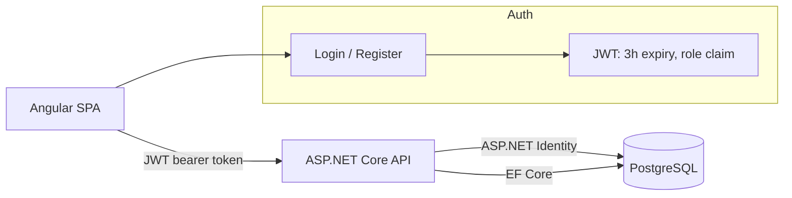

# CookingHub

**A cooking-class marketplace: admins publish classes, learners request seats and leave feedback.**

[](https://github.com/hrxth-xk/CookingHub/actions/workflows/main_cooking-hub.yml)


A two-role platform for booking hands-on cooking classes. Admins run the catalog — create,
edit, and remove classes, and review who's applied and what feedback came back. Learners
browse the catalog, apply to a class with their dietary preferences and goals, track the
status of their requests, and leave feedback once they've attended.

---

## What it does

**Admin**
- Create, edit, and delete cooking classes (cuisine, chef, duration, fee, skill level, ingredients provided)
- Review every class request across all learners, and update its status
- Read all feedback submitted by learners

**Learner**
- Browse the class catalog
- Apply to a class with dietary preferences, cooking goals, and comments
- Track the status of their own requests
- Submit and review their own feedback

Role is enforced both in the API (`[Authorize(Roles = "Admin")]` on write endpoints) and in
the Angular router (`AuthGuard` checks the role claim before activating admin/user routes),
so the split isn't just a UI convention.

---

## Architecture



- **Frontend** — Angular 16 SPA. An `HttpInterceptor` attaches the JWT to every request; an
  `AuthGuard` reads the role claim to gate admin vs. learner routes.
- **Backend** — ASP.NET Core Web API on .NET 10. ASP.NET Identity owns user storage and
  password hashing; a custom `AuthService` issues JWTs carrying the user's id, email, and role.
- **Data** — PostgreSQL via EF Core / Npgsql. Migrations are checked in
  (`dotnetapp/Migrations/`).

### Notable decisions

- **Role names are a closed set.** Registration originally passed the client-supplied role
  straight to `RoleManager`, so mismatched casing (`"admin"` vs `"Admin"`) silently created a
  second role that `[Authorize(Roles = "Admin")]` would never match. `AuthService` now
  validates against a fixed `{Admin, User}` set before creating anything.
- **No plaintext passwords at rest.** An early schema stored a plaintext password column
  alongside ASP.NET Identity's hashed one; migration `RemovePlaintextPassword` drops it —
  Identity's `PasswordHash` is the only copy that persists.
- **Secrets are never committed.** `appsettings.json` is git-ignored; `appsettings.Example.json`
  documents every key (connection string, JWT signing secret) and how to supply it via
  environment variables or `dotnet user-secrets`.

---

## Tech stack

**Backend** ASP.NET Core (.NET 10) · ASP.NET Identity · JWT Bearer auth · EF Core · Npgsql (PostgreSQL) · Swashbuckle (OpenAPI/Swagger)
**Frontend** Angular 16 · RxJS · Karma/Jasmine
**Infra** Docker Compose (local Postgres) · GitHub Actions → Azure App Service

---

## Getting started

Requires .NET 10 SDK, Node 18+, and Docker (for local Postgres) — or a Postgres instance of your own.

### Backend

```bash
cd dotnetapp
cp appsettings.Example.json appsettings.json   # fill in ConnectionStrings:con and JWT:Secret
docker compose up -d                            # local Postgres on :5432
dotnet tool restore
dotnet ef database update
dotnet run
```

The API comes up with Swagger UI at `/swagger` — use the **Authorize** button with a token
from `/api/login` to call the protected endpoints.

### Frontend

```bash
cd angularapp
npm install
npm start
```

Serves at `http://localhost:4200` and expects the API at `http://localhost:5000`
(`src/environments/environment.ts`).

### Tests

```bash
cd angularapp && npm test   # Karma/Jasmine
```

---

## API overview

| Endpoint | Access | Notes |
|---|---|---|
| `POST /api/login`, `POST /api/register` | Public | Returns a JWT with `id`, `email`, and `role` claims |
| `GET /api/cookingclass`, `GET /api/cookingclass/{id}` | Public | Browse the catalog |
| `POST/PUT/DELETE /api/cookingclass` | Admin | Manage the catalog |
| `GET /api/cookingclassrequest`, write/status endpoints | Admin | All learner requests |
| `GET /api/cookingclassrequest/user/{userId}` | Authenticated | A learner's own requests |
| `GET /api/feedback`, `DELETE /api/feedback/{id}` | Admin | All feedback |
| `GET /api/feedback/user/{userId}`, `POST /api/feedback` | Authenticated | A learner's own feedback |

Full request/response shapes are in Swagger once the backend is running.

---

## Project structure

```
dotnetapp/
  Controllers/    AuthenticationController, CookingClassController, CookingClassRequestController, FeedbackController
  Services/       business logic + IAuthService/AuthService (JWT issuance, role validation)
  Models/         EF entities (CookingClass, CookingClassRequest, Feedback, ApplicationUser)
  Migrations/      EF Core migrations
  Data/            ApplicationDbContext
angularapp/
  src/app/components/  feature components, split admin*/user* by role
  src/app/services/    HTTP clients per resource
  src/app/interceptors/ JWT attach-on-request
  src/app/components/authguard/ route-level role gate
```

---

## Deployment

The backend deploys automatically to Azure App Service on every push to `main`
(`.github/workflows/main_cooking-hub.yml`). The frontend is run locally against it via
`environment.prod.ts`.

---

## License

All rights reserved — see [LICENSE](LICENSE). Shared publicly for portfolio and review
purposes; not licensed for reuse.
